# Indian Agricultural Market Price Analytics

An end-to-end data analytics portfolio project exploring agricultural market prices across Indian states, districts, markets, and commodities.

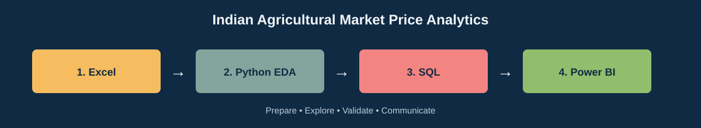

## Project Overview

This project moves from raw market data to an analysis-ready dataset, analytical SQL queries, Python exploratory data analysis, and a Power BI report-ready model.

The dataset was sourced from the Government of India agricultural market data available through the official [data.gov.in](https://data.gov.in/) open-data portal.

The analysis covers a snapshot containing **6,141 records**, **18 states**, **131 districts**, **302 markets**, and **132 commodities**. The available data represents one arrival date, so this project focuses on cross-sectional comparisons rather than historical price trends.

## Four-Phase Workflow

### Phase 1: Excel - Data Preparation

- **Data source:** Government of India agricultural market data, obtained through the official `data.gov.in` open-data portal.
- Raw and cleaned CSV files
- Cleaned Excel workbook with the `Cleaned_Data` sheet
- Preparation of price fields, dates, and analysis-ready columns

Files: [Phase-1 Excel](Phase-1%20Excel/)

The Excel phase preserves both the raw source extract and the cleaned workbook used by the Python, SQL, and Power BI phases.

#### Excel Visual Analysis

##### 1. Raw Data

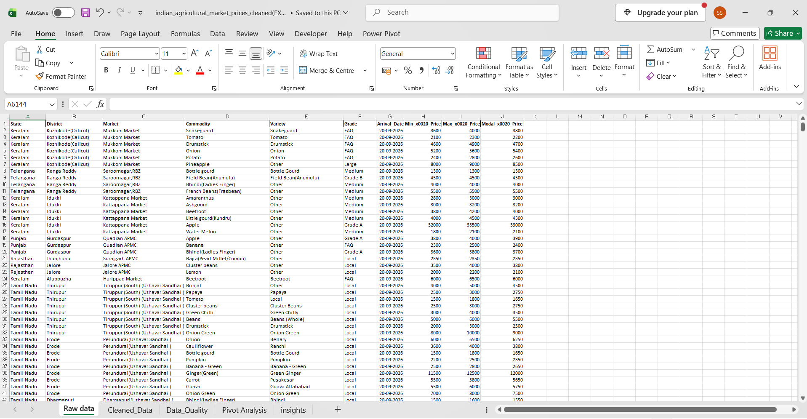

This sheet contains the original market-price records with state, district, market, commodity, variety, grade, arrival date, and price fields. It provides the starting point for the cleaning and validation workflow.

##### 2. Cleaned Data

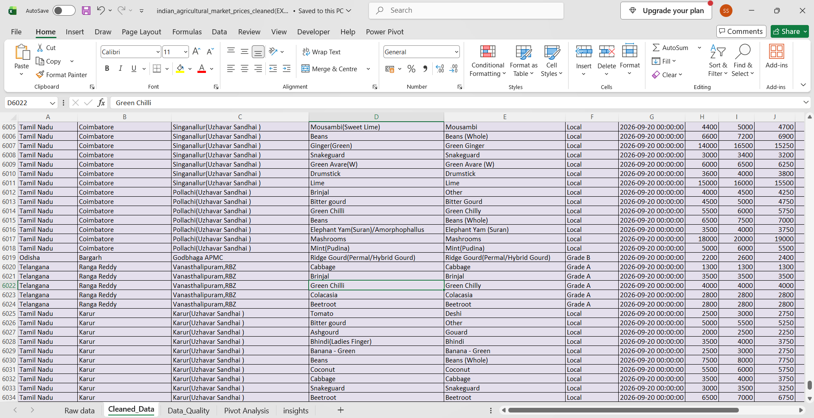

The cleaned sheet contains standardized records prepared for analysis, including consistent dates and minimum, maximum, and modal price values. This table is the shared input for the Python, SQL, and Power BI phases.

##### 3. Data Quality

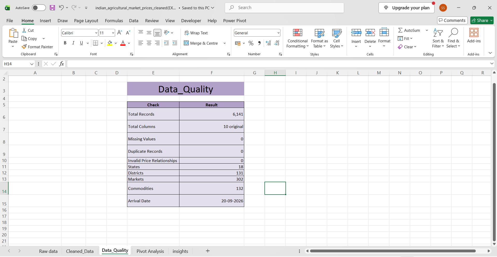

The data-quality summary reports 6,141 records, 0 missing values, 0 duplicate records, and 0 invalid price relationships. It also documents coverage across 18 states, 131 districts, 302 markets, and 132 commodities.

##### 4. Pivot Analysis

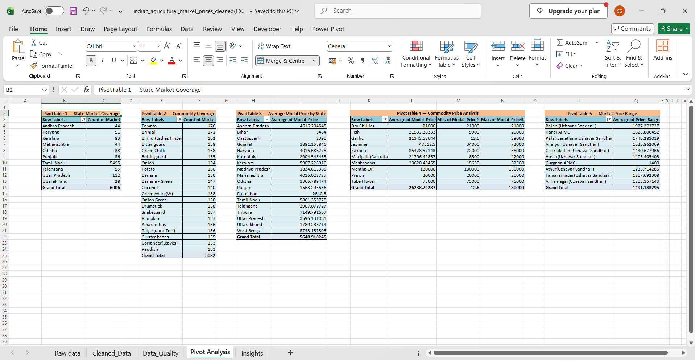

These pivot tables summarize state market coverage, commodity availability, average modal price by state, commodity price ranges, and market price ranges. They convert the detailed dataset into comparable decision-focused summaries.

##### 5. Insights

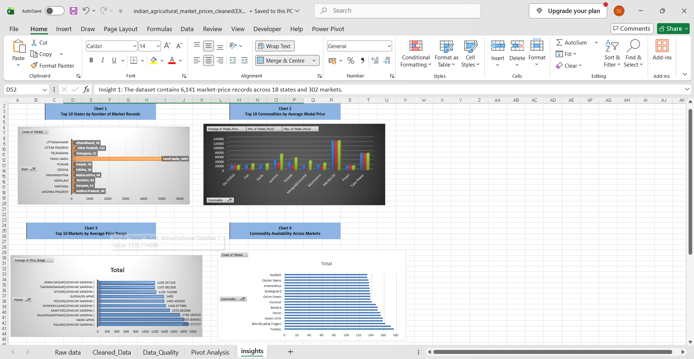

The insights sheet presents charts for state record counts, commodity modal prices, market price ranges, and commodity availability. It turns the pivot results into visual findings that can be communicated in the final portfolio analysis.

### Phase 2: Python - Exploratory Data Analysis

The Python workflow validates the data, calculates descriptive statistics, and analyzes state, commodity, and market patterns.

- Missing-value and duplicate checks
- Descriptive statistics for minimum, maximum, and modal prices
- State-level record and market coverage analysis
- Commodity price comparison
- Market price-range analysis
- Outlier flagging for unusually low and high modal prices

Files: [Python EDA script](Phase-2%20Python/Python(EDA).py)

#### Python Visual Analysis

##### Top states by record count

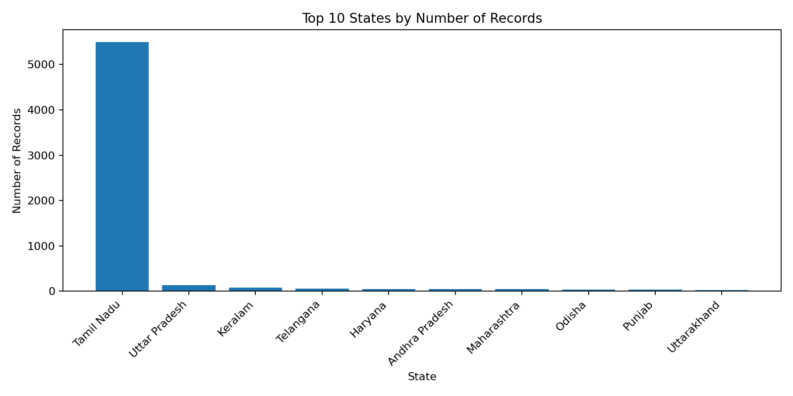

Tamil Nadu contributes the largest share of records in this snapshot, with 5,495 records.

##### Top commodities by average modal price

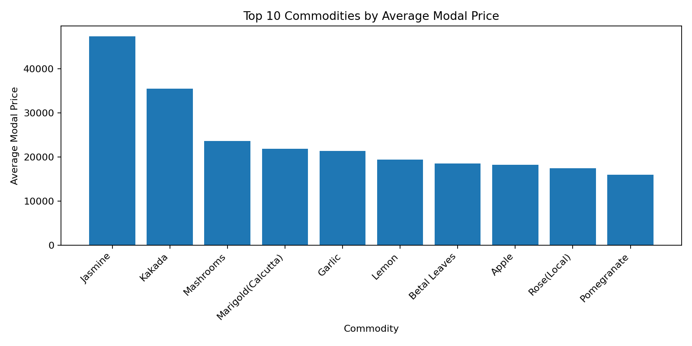

Among commodities with at least five records, Jasmine has the highest average modal price, followed by Kakada.

##### Modal price distribution

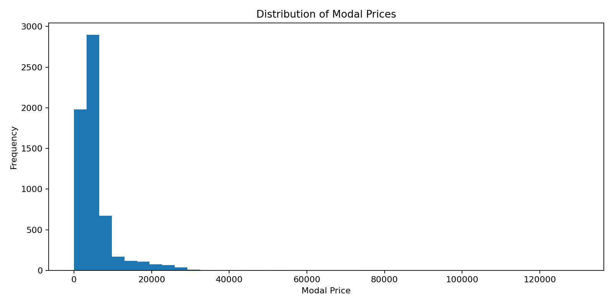

The modal prices range from ₹0.02 to ₹130,000. Low and high values are flagged for review rather than being removed automatically.

##### Markets by average price range

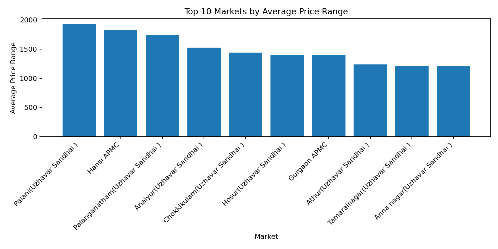

Palani (Uzhavar Sandhai) has the largest average price range among the markets analyzed.

### Phase 3: SQL - Structured Analysis

The SQL phase converts the cleaned dataset into structured, reusable queries for validation, descriptive analysis, and ranking.

Files: [Phase-3 SQL analysis](Phase-3%20Sql_Analysis/)

#### SQL Analysis Workflow

##### 1. Database Setup

[DATABASE SETUP.sql](Phase-3%20Sql_Analysis/DATABASE%20SETUP.sql) selects the project database used by the analysis queries. This establishes the common table context for the remaining SQL files.

##### 2. Data Validation

[DATA VALIDATION.sql](Phase-3%20Sql_Analysis/DATA%20VALIDATION.sql) checks total records, arrival-date coverage, and distinct counts for states, markets, and commodities. These checks confirm the basic shape of the dataset before deeper analysis.

##### 3. Data Quality Analysis

[Data-quality analysis.sql](Phase-3%20Sql_Analysis/Data-quality%20analysis.sql) checks price relationships and flags unusually low or high modal prices. The validation preserves unusual values for review instead of removing them automatically.

##### 4. State-Level Analysis

[State-level analysis.sql](Phase-3%20Sql_Analysis/State-level%20analysis.sql) compares record counts, average modal prices, and market coverage across states. This identifies differences in geographic representation and price levels.

##### 5. Commodity Analysis

[Commodity analysis.sql](Phase-3%20Sql_Analysis/Commodity%20analysis.sql) ranks commodities by average modal price, market availability, and modal-price spread. A minimum record threshold is used for more reliable commodity comparisons.

##### 6. Market Analysis

[Market analysis.sql](Phase-3%20Sql_Analysis/Market%20analysis.sql) identifies markets with the largest average price ranges and compares their record counts and average modal prices. This highlights markets with greater price variation.

##### 7. Window Function Analysis

[SQL Window Function.sql](Phase-3%20Sql_Analysis/SQL%20Window%20Function.sql) uses a common table expression and `DENSE_RANK()` to rank commodities by average modal price. This demonstrates advanced SQL analysis beyond basic grouping and aggregation.

### Phase 4: Power BI - Reporting Dataset

The cleaned CSV and Power BI report file provide the foundation for interactive reporting and dashboard development.

Files: [Phase-4 Power BI](Phase-4%20Power%20BI/)

## Power BI Dashboard Screenshots

### Agricultural Market Overview

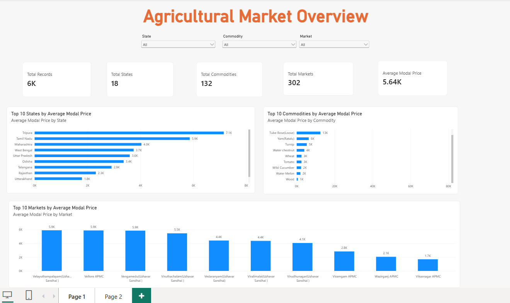

This overview page presents the main KPIs: total records, states, commodities, markets, and average modal price. It also includes interactive filters for state, commodity, and market, with visuals for the top states, top commodities, and top markets by average modal price.

### Price Analysis & Insights

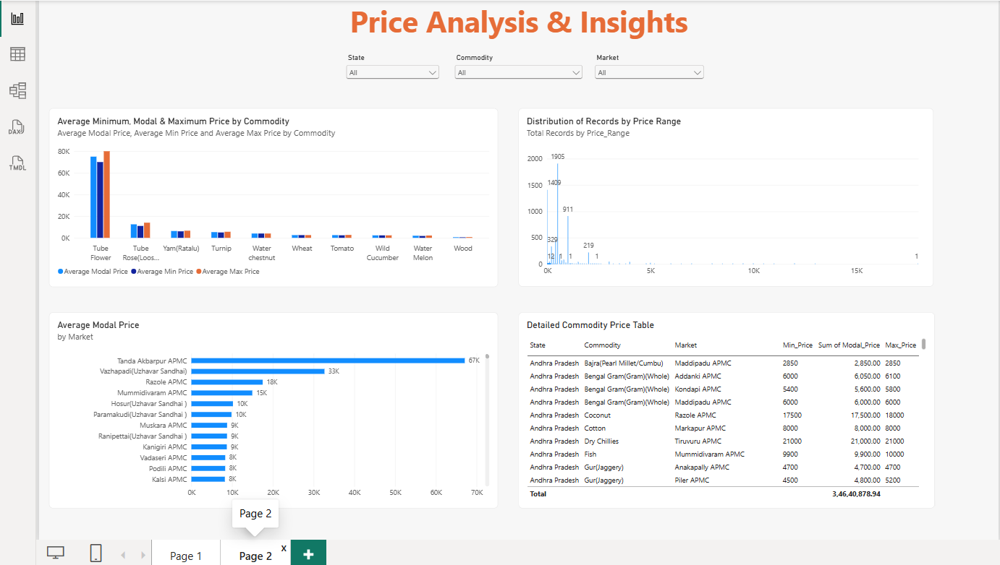

This analysis page compares average minimum, modal, and maximum prices by commodity, shows the distribution of records by price range, ranks markets by average modal price, and provides a detailed commodity price table.

## Key Findings

- Average modal price: **₹5,640.92**
- Median modal price: **₹4,250**
- 15 records have modal prices below ₹100
- 7 records have modal prices of ₹50,000 or more
- The dataset contains only one date, so historical trend conclusions are out of scope
- Direct commodity price comparisons should be interpreted carefully because market and unit conventions may differ

## Tools Used

`Microsoft Excel` `Python` `pandas` `matplotlib` `MySQL` `Power BI`

## Repository Structure

```text
Phase-1 Excel/       Raw and cleaned data files
Phase-2 Python/      Python EDA script and Excel input
Phase-3 Sql_Analysis/SQL setup, validation, and analysis queries
Phase-4 Power BI/    Cleaned CSV and Power BI report
assets/              README screenshots and workflow graphic
```

## How to Reproduce the Python Analysis

1. Install Python with `pandas`, `matplotlib`, and `openpyxl`.
2. Open `Phase-2 Python/Python(EDA).py`.
3. Run the script from the project root.
4. Review the console summary and exported charts in `assets/`.

## Limitations and Next Steps

- Add multiple arrival dates to support time-series analysis.
- Standardize price units before comparing commodities directly.
- Add a data dictionary and automated validation checks.
- Extend the Power BI report with time-based trend visuals when additional arrival dates become available.

## Portfolio Note

This repository demonstrates a complete analytics workflow: preparing data, validating quality, querying structured data, exploring patterns programmatically, and preparing an interactive BI deliverable.
